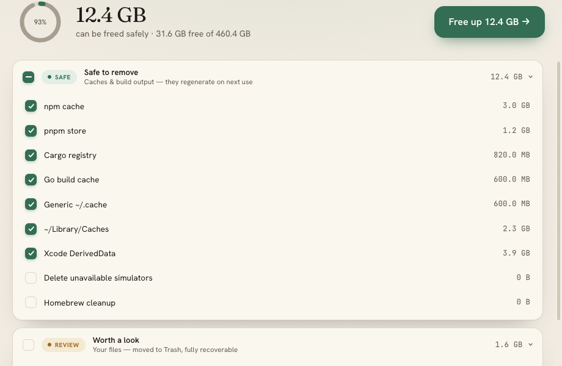

# dscan

[](https://github.com/gor3a/disk-scan/actions/workflows/ci.yml)
[](LICENSE)
[](https://goreportcard.com/report/github.com/gor3a/disk-scan)
[](https://github.com/gor3a/disk-scan/releases/latest)
[](https://ko-fi.com/gor3a)

Interactive disk scanner & cleaner for macOS and Linux — a friendly desktop app
and a terminal TUI, sharing one engine.

`dscan` scans known cache/build/package locations plus the largest items in your
home dir, groups them by category and safety tier, and lets you check off what to
clean. Regenerable caches are hard-deleted; real user data is moved to the OS
Trash; protected data (browser profiles, messaging apps, SSH keys) is never
selectable.



## Desktop app

Download the latest `.dmg` (macOS), `.AppImage` or `.deb` (Linux) from the
**[Releases page](https://github.com/gor3a/disk-scan/releases/latest)**.

The builds are currently **unsigned**:

- **macOS** (Apple Silicon): right-click the app → **Open** the first time, or
  run `xattr -dr com.apple.quarantine /Applications/dscan.app`.
- **Linux**: `chmod +x dscan-*.AppImage` and run it, or install the `.deb`.

It auto-scans on launch, pre-selects the regenerable `SAFE` caches, and reclaims
space in one click — `REVIEW` items are opt-in, `KEEP` items are locked.

## Command line

```
dscan              # scan + interactive checklist
dscan --system     # also scan system dirs (slow, may need permissions)
dscan --dry-run    # preview what would be cleaned, delete nothing
dscan --yes        # non-interactive: clean all SAFE items (caches/build), no TTY needed
dscan --yes --dry-run   # preview the non-interactive clean
dscan --version
```

Keys (interactive): `↑/↓` move · `space` toggle · `enter` review · `enter`/`y` confirm · `q` quit.

`--yes` is for scripts/CI: it cleans only regenerable `SAFE` items and never
touches `REVIEW`/`KEEP` data or runs tool-commands.

## Install the CLI

With a Go toolchain installed:

```
go install github.com/gor3a/disk-scan@latest   # installs the `disk-scan` binary into $GOBIN
```

Or build from a checkout as `dscan`:

```
go build -o ~/.local/bin/dscan .   # ensure ~/.local/bin is on your PATH
```

## Safety

- SAFE (caches, build output) → hard-deleted (regenerates on next use).
- REVIEW (user data) → moved to the OS Trash, recoverable:
  - macOS: via Finder, so items get "Put Back" support.
  - Linux: via `gio trash`, or the XDG trash spec (`~/.local/share/Trash`
    with `.trashinfo` records) when `gio` is unavailable.
  - Trashing never overwrites an existing trashed item and works across
    filesystems (copy + remove fallback).
- KEEP (browser/messaging/SSH) → shown but never selectable.
- A confirm screen summarizes deletes vs trash vs tool-cleanups before anything
  is touched; `--dry-run` performs no deletion at all.

## Contributing

Contributions are welcome — especially new catalog entries for caches we don't
yet recognize. See **[CONTRIBUTING.md](CONTRIBUTING.md)** for the dev setup, the
TDD workflow, the safety rules around deletion, and how to add a catalog entry.

Please also read our **[Code of Conduct](CODE_OF_CONDUCT.md)**. To report a
security issue, see **[SECURITY.md](SECURITY.md)** (do not open a public issue).

## Support

dscan is free and open source. If it reclaimed some space for you and you'd like
to say thanks, you can **[buy me a coffee on Ko-fi](https://ko-fi.com/gor3a)** ☕.
It's always appreciated and never required.

## License

[MIT](LICENSE) © gor3a
